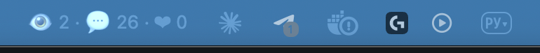

# twitchbar

Your Twitch channel in the menu bar. The live viewer count sits in the bar, every chat message, follower, sub, raid and cheer arrives as a notification with its own sound, and one click shows the whole session. Every row of the menu and every banner opens the right Twitch page: the chat popout, a viewer's channel, the stream manager.

<p align="center">
  
</p>

Two viewers, twenty-six messages you have not looked at yet, no new followers: that is the whole stream at a glance, and every one of those messages arrived as a banner with a sound the moment it was posted.

Built for small channels. When three people are watching, each of them matters, and a message deserves an answer within seconds, not whenever you next glance at the chat window. twitchbar makes sure you hear it.

## What you get

- **Menu bar text** with viewers, unread messages and new followers this stream. The message count is what arrived since you last opened the menu, so a glance tells you whether there is anything to answer; opening the menu resets it. Offline the bar shows `⏸`.
- **A banner and a sound** for each of these, so you can tell them apart by ear:

  | Event | Banner | Sound |
  |---|---|---|
  | Chat message | 💬 alice: hi! what are you working on? | Pop |
  | New follower | ❤️ New follower · bob | Hero |
  | Sub, resub, gifted subs | ⭐ New sub · alice · Tier 1 | Glass |
  | Raid | 🚀 Raid · friendly_streamer brought 12 viewers | Funk |
  | Bits | 💎 100 bits · bob: take my bits | Purr |
  | Someone joined chat | 👋 Joined chat · carol | Tink |
  | Stream went live | 🟢 Live | Ping |
  | Stream ended | ⚫ Offline · 41 messages · 3 followers … | Basso |

- **The menu**: live status with uptime, category and title, how many people are in chat, the session counters, the last ten messages, who is in chat right now, a quiet-mode switch and links to your channel, your chat popout and the stream manager.
- **Everything is a link.** Click a message to jump into the chat popout and answer, click a name in the chatter list to open that person's channel, click the live line to open your stream, click a banner to open the page behind it.
- **Quiet mode**: the menu keeps updating, the banners stop. For the moments you are on camera and cannot react anyway.
- **Starts at login** on macOS with one command.
- **Local only**. Credentials and the token live in your user profile with owner-only permissions; the only network traffic is to Twitch's API.

## Install

### 1. Create a Twitch application

twitchbar talks to Twitch on your behalf, so it needs an application registered under your account. This takes two minutes and is free.

1. Open <https://dev.twitch.tv/console/apps> and sign in with your Twitch account. Twitch requires two-factor authentication to be enabled on the account before it lets you register an application.
2. Click **Register Your Application**.
3. Fill in the form:
   - **Name**: anything, for example `mybar`. Twitch rejects names containing the word *twitch*.
   - **OAuth Redirect URLs**: `http://localhost:17563` and click **Add**.
   - **Category**: Application Integration.
   - **Client Type**: Confidential.
4. Click **Create**, then open the application you just made with **Manage**.
5. Copy the **Client ID**. Click **New Secret**, confirm, and copy the **Client Secret**. The secret is shown once; if you lose it, generate a new one.

### 2. Install twitchbar

twitchbar is a Python application installed with [uv](https://docs.astral.sh/uv/), which also fetches the right Python for you.

macOS:

```bash
curl -LsSf https://astral.sh/uv/install.sh | sh
uv tool install git+https://github.com/Artod/twitchbar
```

Windows (PowerShell):

```powershell
powershell -ExecutionPolicy ByPass -c "irm https://astral.sh/uv/install.ps1 | iex"
uv tool install git+https://github.com/Artod/twitchbar
```

Open a new terminal afterwards so `twitchbar` is on the path. To update later: `uv tool upgrade twitchbar`.

### 3. Store the credentials and sign in

```bash
twitchbar setup
```

Paste the Client ID and the Client Secret when asked. Then start it:

```bash
twitchbar
```

The first run opens your browser on Twitch's authorization page listing the permissions twitchbar asks for (read chat, followers, chatters, subscriptions and bits of your own channel). Click **Authorize**. The browser lands on a "you may close this window" page, the token is saved, and `👁` appears in the menu bar. Later runs need no browser.

The first alert makes macOS ask whether **python3.x** (the interpreter running twitchbar) may show notifications. Click that banner and choose **Allow**. If you missed it, open System Settings → Notifications, find the python entry and switch it on. Sounds play either way: they come from twitchbar itself, not from the banner, so you hear a message even if you never answer that prompt.

### Start at login

```bash
twitchbar autostart on
```

`twitchbar autostart off` removes it again. On Windows, put a shortcut to `twitchbar` into the Startup folder (Win+R, `shell:startup`).

## Configuration

`twitchbar paths` prints where the files are. On macOS the config is `~/Library/Application Support/twitchbar/config.toml`:

```toml
client_id = "..."
client_secret = "..."
poll_seconds = 30.0          # viewer count and chatter list refresh interval
recent_messages = 10         # how many messages the menu keeps
notify_own_messages = false  # ping on your own chat messages too
notify_joins = true          # ping when a logged-in viewer appears in chat
ignore_users = ["nightbot", "streamelements", "streamlabs", "moobot", "fossabot", "wizebot"]

[sounds]                     # any macOS system sound, or "" for silent
message = "Pop"
follow = "Hero"
sub = "Glass"
raid = "Funk"
cheer = "Purr"
join = "Tink"
online = "Ping"
offline = "Basso"
```

The macOS system sounds are Basso, Blow, Bottle, Frog, Funk, Glass, Hero, Morse, Ping, Pop, Purr, Sosumi, Submarine and Tink. Edit the file and restart twitchbar to apply.

Environment variables `TWITCHBAR_CLIENT_ID` and `TWITCHBAR_CLIENT_SECRET` override the file, and `TWITCHBAR_CONFIG` points at a different config file, which is handy for a second channel.

## Commands

| Command | What it does |
|---|---|
| `twitchbar` | Run the tray. Same as `twitchbar run`. |
| `twitchbar --demo` | Play a scripted stream: see the menu and hear every sound without a Twitch account. |
| `twitchbar --quiet` | Start with quiet mode on. |
| `twitchbar --no-notify` | Log alerts instead of showing banners. |
| `twitchbar --tray generic` | Force the cross-platform tray backend (see Platforms). |
| `twitchbar -v` | Debug logging on the terminal. |
| `twitchbar setup` | Store the Client ID and Client Secret. |
| `twitchbar logout` | Forget the stored token; the next run asks for authorization again. |
| `twitchbar autostart on\|off` | Start at login (macOS). |
| `twitchbar paths` | Print the config, token and log locations. |

Everything twitchbar does is also written to `twitchbar.log` in the log folder, including how long each chat message took to arrive.

## How it works

Twitch pushes some events and never pushes others, so twitchbar mixes two mechanisms:

| Event | Source | Delay |
|---|---|---|
| Chat messages | EventSub WebSocket, `channel.chat.message` | instant |
| Followers | EventSub, `channel.follow` | instant |
| Subs, resubs, gifted subs | EventSub, `channel.subscribe`, `channel.subscription.message`, `channel.subscription.gift` | instant |
| Raids, bits | EventSub, `channel.raid`, `channel.cheer` | instant |
| Stream online / offline | EventSub, `stream.online`, `stream.offline` | instant |
| Viewer count, title, category | Helix `Get Streams`, polled | up to `poll_seconds` |
| Who is in chat | Helix `Get Chatters`, polled and diffed | up to `poll_seconds` |

One honest limitation: **Twitch does not tell anyone when a viewer opens a stream.** The old IRC `JOIN` notices are gone and there is no EventSub equivalent. What twitchbar can do is poll the list of accounts connected to chat and notify you about newcomers. Logged-out viewers never appear in that list, so an anonymous lurker only shows up as a higher viewer count.

Session counters reset every time the stream goes live, so the numbers in the menu always mean "this stream".

## Platforms

- **macOS**: the primary target. Native menu bar text via [rumps](https://github.com/jaredks/rumps), banners through Notification Center posted by twitchbar itself (a plain Python process gets a bundle identifier at runtime for that), a system sound per event played in-process, no Dock icon.
- **Windows and Linux**: experimental. The tray backend uses [pystray](https://github.com/moses-palmer/pystray) and draws the viewer count into the icon, since those trays have no text. A left click on the icon opens the chat popout and resets the unread count; the menu is on the right button. Notifications come from the tray's own balloon on Windows and from `notify-send` on Linux; sounds are whatever the system plays. This backend runs on macOS too (`twitchbar --tray generic`), which is how it was tested; reports from Windows users are welcome.

## Troubleshooting

- **`zsh: command not found: twitchbar` right after `uv tool install`**: uv puts its tools in `~/.local/bin`, which is not on PATH on a fresh shell. Run `uv tool update-shell`, open a new terminal, try again.
- **"Invalid client name" on the Twitch console**: the application name must not contain the word *twitch*.
- **The browser says the redirect failed**: the redirect URL in the Twitch console must be exactly `http://localhost:17563`, and nothing else may be listening on port 17563 while you authorize.
- **Sounds play but no banners on macOS**: the notification permission was not granted. System Settings → Notifications → the **python3.x** entry (named after the interpreter) → allow. Also check that a Focus mode is not on.
- **No sound at all on macOS**: the sound name in `[sounds]` is not one of the system sounds; the log says which one. `""` means silent on purpose.
- **The bar shows `⚠️ twitchbar`**: the connection failed; the log in `twitchbar paths` says why. A revoked token is fixed by `twitchbar logout` and starting again.
- **Chat messages arrive but no join notifications**: the token predates the chatters permission. `twitchbar logout`, start again, authorize.

## Development

```bash
git clone https://github.com/Artod/twitchbar
cd twitchbar
uv sync
uv run twitchbar --demo
```

Checks, all of which run in CI on macOS, Linux and Windows:

```bash
uv run ruff check . && uv run ruff format --check . && uv run mypy && uv run pytest
```

The same four run as a pre-commit hook once you enable it in your clone:

```bash
git config core.hooksPath .githooks
```

Layout, one responsibility per module:

| Module | Responsibility |
|---|---|
| `events.py` | The event types every other module speaks. Plain dataclasses, no SDK. |
| `stats.py` | Session state: counters, recent messages, who is in chat, which events earn an alert, menu text. Pure Python, fully unit-tested. |
| `twitch_source.py` | The live source: EventSub subscriptions plus Helix polling on a background thread. |
| `demo.py` | The scripted source behind `--demo`. |
| `auth.py` | Sign-in, token storage and refresh. |
| `notify.py`, `notify_mac.py` | Notification backends behind one protocol; the macOS one posts to Notification Center from inside the process and plays the sound. |
| `links.py` | The Twitch pages a click can open. |
| `tray/` | Tray backends behind one protocol: `mac.py` (rumps) and `generic.py` (pystray). |
| `app.py` | The UI-thread loop: drain events, update stats, show alerts, render the tray. |
| `cli.py` | Commands and wiring. |

Adding a new alert is one `match` arm in `stats.py`, one callback in `twitch_source.py`, and a line in the sounds table.

## License

MIT.
